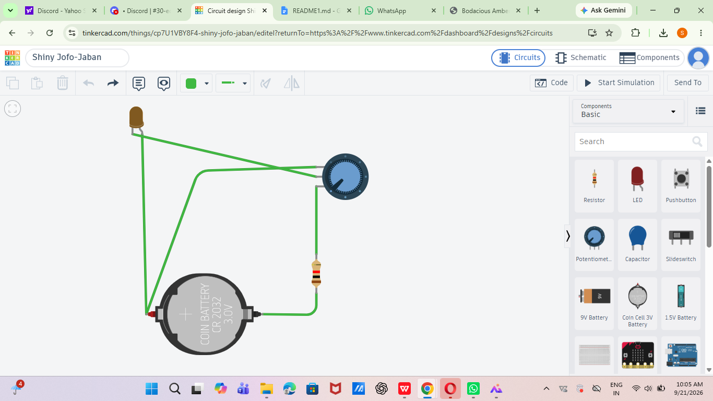
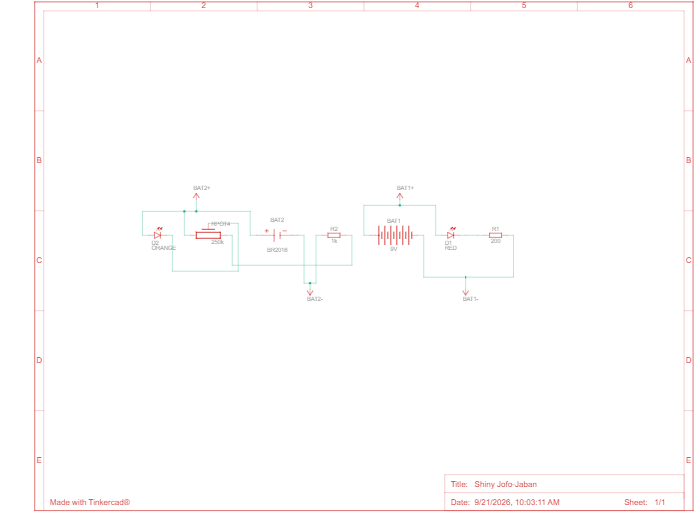
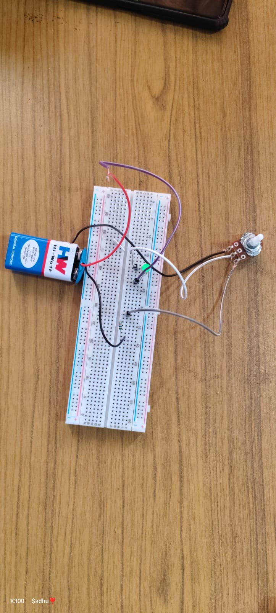

                         **GLOWING OF LED USING VARIABLE RESISTOR**

*  **Aim**

* To design and implement a simple LED circuit using a 9V battery and potentiometer.

*  **Introduction**

* An LED is a semiconductor device that emits light when electric current flows through it. In this project, a 9V battery is used as the power source and a potentiometer is used to control the current supplied to the LED.

*  **Apparatus Required**

- 9V Battery – 1  
- Breadboard – 1  
- LED – 1  
- Potentiometer – 1  
- Resistor – 1  
- Jumper wires – Required

*  **Working Principle**

* The circuit works based on the forward-biasing principle of an LED. When the 9V battery supplies voltage, current flows through the resistor and potentiometer to the LED. The LED glows when sufficient current flows through it. The potentiometer can be adjusted to control the brightness of the LED.

*  **Circuit Diagram** 

* The positive terminal of the 9V battery is connected to the positive rail of the breadboard. The negative terminal is connected to the negative rail. The potentiometer and resistor are connected in series with the LED to control the current. The LED is connected with correct polarity.

*  **Schematic Diagram** 

* The schematic consists of a 9V DC supply, potentiometer, current-limiting resistor and LED connected in a series path. The potentiometer controls the current through the LED and hence its brightness.

*  **Construction**

1\. Place the components on the breadboard.

2\. Connect the 9V battery to the breadboard power rails.

3\. Connect the potentiometer to the supply.

4\. Connect the resistor in series with the LED.

5\. Connect the LED with correct polarity.

6\. Check all connections properly.

7\. Connect the 9V battery.

8\. Adjust the potentiometer and observe the LED brightness.

*  **Working**

* When the 9V battery is connected, it provides DC power to the circuit. Current passes through the potentiometer and resistor before reaching the LED. The resistor protects the LED from excessive current. By rotating the potentiometer, the current through the LED can be varied, causing the LED brightness to change.

*  **Applications**  
    
- LED brightness control  
- Indicator circuits  
- Simple electronic projects  
- Educational experiments  
- Low-voltage lighting circuits  
    
* **RESULT**

(Thus, the LED circuit using a 9V battery was successfully designed and implemented, and the brightness of the LED was controlled using the potentiometer.

